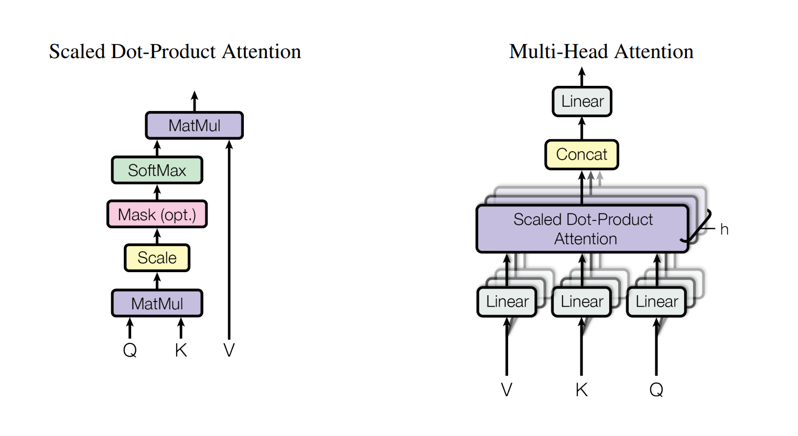
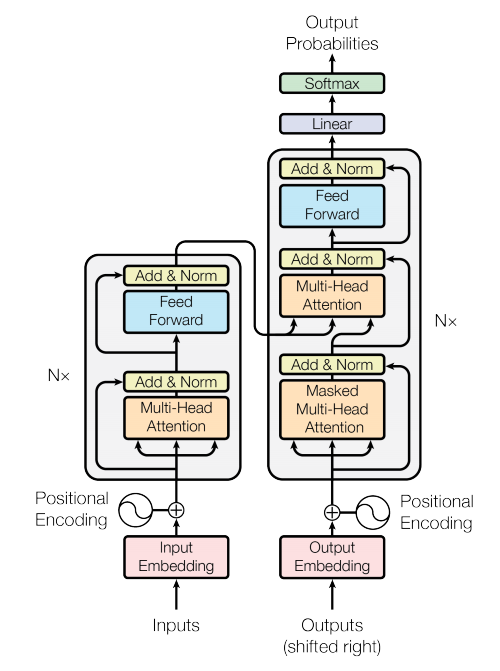

# neural-machine-transalation-eng-vi
A simple Neural Machine Translation model using Transformer architecture to translate from English to Vietnamese

All of this was implemented on Kaggle website for the support of GPU T4 x 2 

## Model architecture

This is using a simple Transformer Architecture with 6 encoder blocks, 6 decoder blocks. All of which uses Multi-head attention mechanism with scaled-dot product with 8 attention heads.

  

   <em>Visualization of scaled dot-product and multi-head attention mechanism (source: https://arxiv.org/pdf/1706.03762.pdf)</em>

The model dimension is 512, position-wise feed forwarding dimension is 2048 and some dropout layers with the drop rate of 0.1.

  

   <em>Transformer architecture (source: https://arxiv.org/pdf/1706.03762.pdf)</em>

## Dataset
I use the Preprocessed Dataset from IWSLT'15 English-Vietnamese machine translation: English-Vietnamese.
Link: https://huggingface.co/datasets/mt_eng_vietnamese

## Training

I used Adam optimizer, with the initial learning rate = 1e-4
The model was trained on 10 epoches, using batch size of 16  

## Result

The results on evaluation set (test set) after running on 10 epoches:
* Loss: 2.175
* BLEU score: 26.404

## Future work (as of 22/2/2024)

* Will make this usable for github users :D 
* Will upload the model onto huggingface
  
## Reference
* https://github.com/bentrevett/pytorch-seq2seq/
* https://sebastianraschka.com/blog/2023/self-attention-from-scratch.html
* https://arxiv.org/pdf/1706.03762.pdf
* https://www.youtube.com/watch?v=U0s0f995w14
